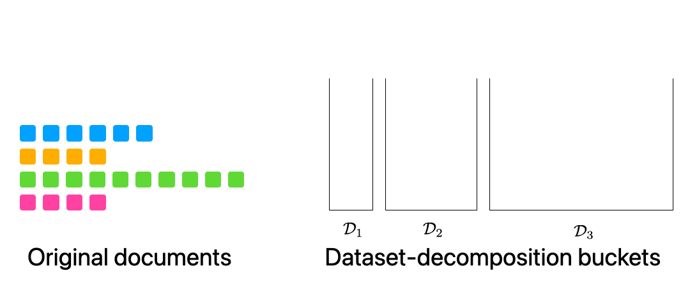
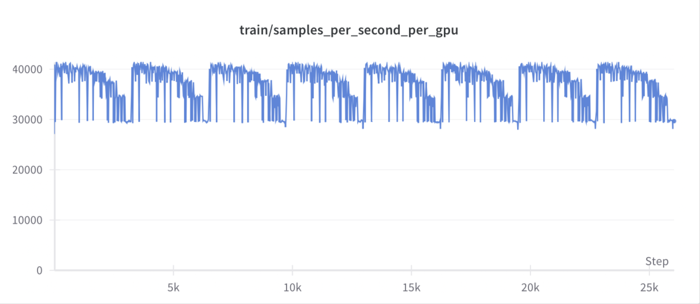
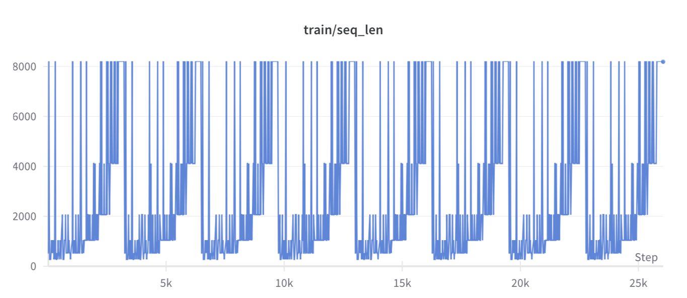

# Dataset-Decomposition

This repository contains the implementation of the [Dataset Decomposition NeurIPS 2024 paper](https://arxiv.org/abs/2405.13226). 
The training code is based on the [OpenLM repository](https://github.com/mlfoundations/open_lm), as explained below.

Dataset decomposition enables **fast pre-training for long-context** inputs by organizing documents into buckets based on their length.
Additionally, a **length-based curriculum** can be applied (starting with short sequences and gradually progressing to longer ones) 
to achieve **improved performance** on both regular and long-context benchmarks.



## Table of Contents

- [Setup](#setup)
- [Create Decomposed Datasets](#create-decomposed-datasets)
- [Launch Variable Sequence Length Training](#launch-variable-sequence-length-training)
- [Results](#results)
- [Citation](#citation)

## Setup

Clone [OpenLM](https://github.com/mlfoundations/open_lm) and apply our patch to enable variable sequence length training. 
Install the requirements as instructed in the [OpenLM repository](https://github.com/mlfoundations/open_lm).
Then, from the root of this repo perform the following steps:
```shell
git clone https://github.com/mlfoundations/open_lm.git
cd open_lm
git checkout 9bb92ef1689333534b7057942a20d18a46d1fa52
git apply ../open_lm.patch
# Install dependencies as required by OpenLM
cd ..
```

## Create decomposed datasets

Dataset decomposition is a per-document method and is applicable to any dataset. 
Here, we show an example for small datasets in the form of JSONL files.

### Step 1:
Get some data. Make sure to upgrade the [datasets library](https://pypi.org/project/datasets) (we use version 3.1).
```shell
mkdir -p /mnt/raw_datasets/wiki
python scripts/wiki_download.py --output-dir /mnt/raw_datasets/wiki
```
Once the download is complete, you will have 32 JSONL files.
Alternatively, you can run [scripts/dclm_download.py](scripts/dclm_download.py) to 
download a small potion of the [DCLM dataset](https://www.datacomp.ai/dclm/index.html#home).

### Step 2:
Run tokenize+bucketize+shuffle:
```shell
mkdir -p /mnt/processed_datasets/wiki
python scripts/make_dd_buckets.py --input-files /mnt/raw_datasets/wiki/*.jsonl \
       --output-dir /mnt/processed_datasets/wiki --min-bucket 8 --max-bucket 13 --num-workers 32
```
We use `32` workers here. You can increase this number for faster processing if you have more JSONL files. 
The `--min-bucket` and `--max-bucket` parameters determine the range of buckets for dataset decomposition.
For the example above, buckets will be created for sequences with lengths `2^8=256`, `2^9=512`, ..., `2^13=8192`. 

When this step is completed, buckets will be created with multiple shards per bucket.

### Step 3:
Create the WebDataset manifest files, one for each bucket. This ensures that each bucket has its corresponding manifest for proper dataset handling and processing.
```shell
for i in $(seq 8 13);
do
    python open_lm/open_lm/utils/make_wds_manifest.py --data-dir /mnt/processed_datasets/wiki/D_$i --num-workers 16
done
```
### Step 4 (Optional)
Get stats of the (decomposed) dataset you just created:
```shell
python scripts/get_stats.py --dd-dir /mnt/processed_datasets/wiki
```
With the above bucket sizes, we obtain the following statistics for the Wikipedia and DCLM datasets:
#### Wikipedia
```text
D_8 : # shards: 553    seq-length: 256      # sequences: 2,265,088     # tokens: 579,862,528 
D_9 : # shards: 779    seq-length: 512      # sequences: 1,595,392     # tokens: 816,840,704 
D_10: # shards: 831    seq-length: 1,024    # sequences: 850,944       # tokens: 871,366,656 
D_11: # shards: 690    seq-length: 2,048    # sequences: 353,280       # tokens: 723,517,440 
D_12: # shards: 475    seq-length: 4,096    # sequences: 121,600       # tokens: 498,073,600 
D_13: # shards: 291    seq-length: 8,192    # sequences: 37,248        # tokens: 305,135,616 
********************
Total number of tokens = 3,794,796,544
```
#### DCLM-Baseline subset
```text
D_8 : # shards: 3,560  seq-length: 256      # sequences: 14,581,760    # tokens: 3,732,930,560
D_9 : # shards: 5,996  seq-length: 512      # sequences: 12,279,808    # tokens: 6,287,261,696
D_10: # shards: 7,410  seq-length: 1,024    # sequences: 7,587,840     # tokens: 7,769,948,160
D_11: # shards: 6,309  seq-length: 2,048    # sequences: 3,230,208     # tokens: 6,615,465,984
D_12: # shards: 5,157  seq-length: 4,096    # sequences: 1,320,192     # tokens: 5,407,506,432
D_13: # shards: 4,513  seq-length: 8,192    # sequences: 577,664       # tokens: 4,732,223,488
********************
Total number of tokens = 34,545,336,320
```

## Launch Variable Sequence Length training

### Step 1
Modify a run script with your desired hyperparameters and the path to the dataset.  
Refer to [the paper]((https://arxiv.org/abs/2405.13226))'s Appendix for the full list of hyperparameters.  
The dataset path can be either local or on S3.

### Step 2
For dataset-decomposition parameters, you can use the following [helper code](scripts/get_dd_params.py) (or set them manually).  
For example, the parameters below configure training with a total of `29` billion tokens, `8` epochs/cycles, `8` GPUs, and a global batch size 
of `64*8192` tokens, with buckets sized from `256` to `8192`.  
(One global batch would include `64` sequences for the last bucket of sequences with a length of `8192`):
```shell
python scripts/get_dd_params.py \
      --tokens 28795904000 \
      --epochs 8 \
      --gpus 8 \
      --global-batch-size 64 \
      --number-of-shards 3560 5996 7410 6309 5157 4513 \
      --sequence-per-shard 4096 2048 1024 512 256 128 \
      --sequence_sizes 256 512 1024 2048 4096 8192 \
      --batch-mult 32 16 8 4 2 1 \
      --train-data-mix-weights 32 16 8 4 2 1
```

Here is a short description of each input argument:

- `--tokens`: Total number of tokens to be processed.
- `--epochs`: Number of cycles (also determines the number of checkpoints to save).
- `--gpus`: Total number of GPUs.
- `--global-batch-size`: Global batch size (assuming all sequences are of the longest length, e.g., 8192 here).
- `--number-of-shards`: Number of available shards per bucket.
- `--sequence-per-shard`: Number of sequences per shard per bucket.
- `--sequence_sizes`: Length of sequences in each bucket.
- `--batch-mult`: Batch multipliers to maintain a fixed number of tokens regardless of sequence length.
- `--train-data-mix-weights`: Power-of-2 length-based curriculum (prioritizing shorter sequences first).

It would output the following:
```text
**** Use the following arguments:
--epochs 8
--train-num-samples 3607101440
--dataset-batch-mult 32 16 8 4 2 1
--source-num-seq-per-epoch 1507328 1277952 794624 335872 137216 61440
--train-data-mix-weights 1472 1248 776 328 134 60
```

### Step 3:
Update the [run script](scripts/train_dd.sh) with the above parameters, and launch the training.
Ensure you log in to WandB (or disable WandB reporting) before running the script.

```shell
bash scripts/train_dd.sh
```
The above set of hyperparameters corresponds to [DCLM-Baseline 1B-1x](https://github.com/mlfoundations/dclm)
with a maximum sequence length of `8192`.
To extend beyond `8192`, make sure to update the model configuration files (located in `open_lm/model_configs`).

On an H100 node with 8x GPUs, the above training should take less than 28 hours. 
For this example, the model performance is as follows:

| ArcE   | ArcC   | Hellaswag | LamOAI | Winogrande | Winograd | WikiQA | OBQA  | SQuAD | PIQA  | COPA  | CoQA  | BoolQ |
|--------|--------|-----------|--------|------------|----------|--------|-------|-------|-------|-------|-------|-------|
| 65.0   | 35.5   | 57.8      | 61.0   | 58.9       | 75.5     | 52.5   | 39.8  | 35.3  | 73.4  | 72.0  | 31.8  | 61.7  |

The number of tokens processed per second per GPU (H100) and the sampled sequence length over the course of training 
would be as shown below for this example.





## Results
Please see the full list of ablations in [the paper](https://arxiv.org/abs/2405.13226).  
The following table summarizes some billion-scale results:  

- **RW** refers to the [RefinedWeb dataset](https://huggingface.co/datasets/tiiuae/falcon-refinedweb).  
- **DCLM** refers to the [DCLM-Baseline dataset](https://huggingface.co/datasets/mlfoundations/dclm-baseline-1.0).  
- For models with **SFT**, we follow the same setup as DCLM-Baseline.  
- **DD** refers to Dataset Decomposition, and **C&C** refers to concat-and-chunk.  

All models are trained with a context length of `8192` and a total of `2^40` seen tokens (~1.1 billion tokens).

| **Model**       | Dataset | Method | SFT | MMLU | ArcE | ArcC | Hellaswag | LambadaOAI | Winogrande | Winograd | WikiQA | OBQA | SQuAD | PIQA | COPA | CoQA | BoolQ |
|-----------------|---------|--------|-----|------|------|------|-----------|------------|------------|----------|--------|------|-------|------|------|------|-------|
| *Shots*         | N/A     | N/A    | N/A | *5*  | *3*  | *3*  | *0*       | *0*        | *5*        | *3*      | *3*    | *10* | *3*   | *0*  | *0*  | *0*  | *0*   |
| **Random**      | 0       | N/A    | N/A | 25   | 25   | 25   | 25        | 0          | 50         | 50       | 0      | 25   | 0     | 50   | 50   | 0    | 50    |
| **OpenLM 160m** | DCLM    | DD     | No  | 24.5 | 51.9 | 26   | 40        | 44.2       | 52.5       | 65.6     | 42.4   | 33   | 17.8  | 68.4 | 61   | 19.9 | 58.8  |
| **OpenLM 160m** | DCLM    | DD     | Yes | 25.6 | 52.9 | 27.6 | 39        | 39.9       | 50         | 65.6     | 36.2   | 31.4 | 36.2  | 66.1 | 62   | 29.3 | 49.1  |
| **OpenLM 410m** | RW      | C&C    | No  | 24.8 | 53.6 | 26.6 | 52.7      | 50.5       | 56.7       | 70.7     | 52.6   | 35.6 | 25.5  | 71.3 | 69   | 26.9 | 54.1  |
| **OpenLM 410m** | RW      | DD     | No  | 27   | 55.3 | 27.9 | 55.1      | 53.9       | 59         | 74.4     | 56.3   | 35   | 30.1  | 72.6 | 63   | 28.1 | 62.7  |
| **OpenLM 410m** | DCLM    | DD     | No  | 24.9 | 62.4 | 33.9 | 55.9      | 57.2       | 59.9       | 77.7     | 55.3   | 38.8 | 32    | 73.4 | 68   | 31.3 | 56.2  |
| **OpenLM 410m** | DCLM    | DD     | Yes | 34.8 | 63.3 | 35.4 | 53.5      | 52.9       | 58.7       | 74.4     | 50.1   | 38.4 | 49.4  | 73.2 | 67   | 39.8 | 72.2  |
| **OpenLM 1B**   | DCLM    | DD     | No  | 28.6 | 70.6 | 43.2 | 68.9      | 67.6       | 67.6       | 85.7     | 62.9   | 44.2 | 47.6  | 77.1 | 77   | 39.9 | 58.7  |
| **OpenLM 1B**   | DCLM    | DD     | Yes | 49.1 | 70.7 | 43.1 | 68.6      | 61         | 66.3       | 78.4     | 56.8   | 45   | 57.1  | 77   | 80   | 46.5 | 80.7  |

## Citation
If you like our work, please consider citing [our NeurIPS 2024 paper](https://arxiv.org/abs/2405.13226):
```bibtex
@article{pouransari2024dataset,
  title={Dataset Decomposition: Faster LLM Training with Variable Sequence Length Curriculum},
  author={Pouransari, Hadi and Li, Chun-Liang and Chang, Jen-Hao Rick and Vasu, Pavan Kumar Anasosalu and Koc, Cem and Shankar, Vaishaal and Tuzel, Oncel},
  journal={arXiv preprint arXiv:2405.13226},
  year={2024},
  url={https://arxiv.org/abs/2405.13226}
}
```
